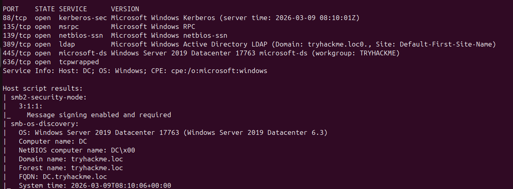
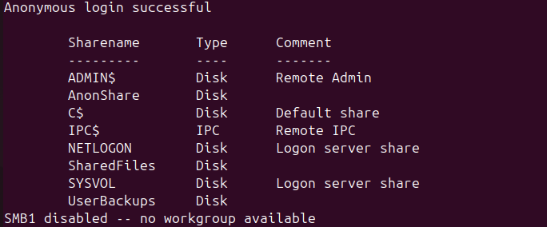
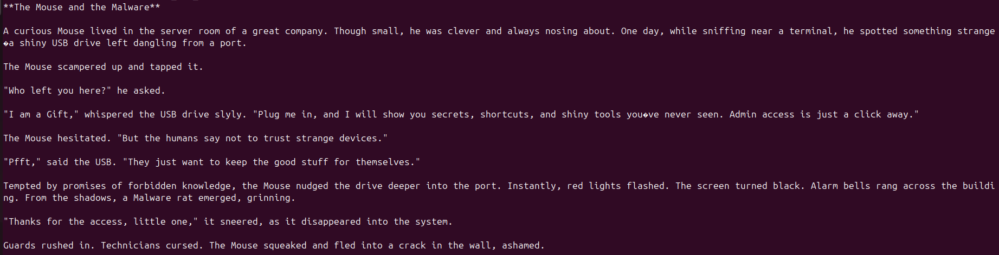

# TryHackMe Writeup: AD Basic Enumeration - Langkah Awal Membedah Domain Controller

Halo semuanya! Ini adalah catatan perjalanan belajar saya di bidang *cyber security*. Sebagai bagian dari tugas *bootcamp* Penetration Testing dari ID-Networkers, saya menantang diri untuk masuk ke ranah yang awalnya terdengar sangat mengintimidasi: **Active Directory (AD)**.

Lab "AD Basic Enumeration" di TryHackMe ini benar-benar membuka mata saya. Ternyata, eksploitasi di dunia nyata itu tidak melulu soal *hacking* brutal pakai *malware* atau mencari *zero-day exploit*. Seringkali, kerentanan paling mematikan justru datang dari kesalahan konfigurasi (*misconfigurations*) dan penyalahgunaan fitur bawaan sistem itu sendiri.

Mari saya ceritakan bagaimana saya membongkar lab ini langkah demi langkah!

---

## 1. Fase Pemetaan Awal: Mencari Tahu Siapa "Tuan Rumahnya"

Setelah terhubung ke jaringan VPN TryHackMe, langkah pertama yang wajib dilakukan tentu saja adalah *reconnaissance* atau pemetaan. Saya mengandalkan *tools* sejuta umat, yaitu **Nmap**. Fokus saya adalah mencari *port* spesifik yang menjadi "napas" dari Active Directory, seperti DNS (53), Kerberos (88), RPC (135), NetBIOS (139), LDAP (389), dan SMB (445).

```bash
nmap -p 88,135,139,389,445 -sV -sC <IP_TARGET>
```


*Keterangan: Hasil pemindaian Nmap menemukan layanan khas Active Directory dan mengidentifikasi OS target.*

Dari hasil scanning, Nmap memberikan informasi yang sangat berharga. Saya menemukan port yang terbuka, dan Nmap scripting engine berhasil membocorkan nama domain target, yaitu `tryhackme.loc`, beserta sistem operasinya: **Windows Server 2019 Datacenter**. Mesin ini dipastikan adalah *Domain Controller* (DC). Langkah awal yang sangat mulus!

## 2. Eksplorasi SMB: Menjadi "Tamu Tak Diundang" dan Terkena Jebakan

Fase selanjutnya adalah mencoba peruntungan di layanan SMB (*Server Message Block*) pada port 445. Menggunakan `smbclient`, saya mencoba masuk menggunakan trik *Null Session—* bertingkah seperti tamu yang datang tanpa *username* dan *password* (`-N`).

```Bash
smbclient -L //10.211.11.10 -N
```


Mengejutkannya, *server* ini mengizinkan saya melihat daftar shared folder! Di antara folder bawaan Windows yang sensitif, ada folder buatan admin yang mencurigakan, salah satunya `AnonShare`.

Saya masuk ke sana, menemukan file `Mouse_and_Malware.txt`, dan membacanya dengan antusias. Hasilnya? **Zonk!** Ternyata itu cuma *rabbit hole* (jebakan) berisi cerita pendek tentang tikus dan USB nakal.



*Keterangan: Mengakses folder AnonShare dan malah menemukan cerita pendek sebagai pengecoh (rabbit hole).*

Pantang menyerah, saya pindah ke folder `UserBackups` dan bingo! Di sana ada file `flag.txt` yang langsung saya unduh.

```Bash
smbclient //<IP_TARGET>/UserBackups -N
smb: \> get flag.txt
```


*Keterangan: Berhasil mengekstrak flag dari folder UserBackups menggunakan smbclient.*

## 3. Menginterogasi Sistem: Ekstraksi Data User dan Grup

Setelah sukses mencuri *flag*, saya beralih mencari tahu siapa saja "penduduk" di dalam domain ini. Saya menggunakan `enum4linux` untuk menarik data secara massal ke dalam sebuah file teks.

```Bash
enum4linux -a 10.211.11.10 > enumerasi_ad.txt
```

Namun, untuk pencarian yang lebih presisi, saya menggunakan `rpcclient`. Melalui *Null Session* `rpcclient`, saya mengeksekusi perintah `enumdomusers` untuk melihat daftar user, dan `queryuser` untuk mengulik detail spesifik seperti mencari tahu nama grup dari user `rduke` atau mencari siapa pemilik Relative Identifier (RID) 1634.

```Bash
rpcclient -U "" 10.211.11.10 -N
rpcclient $> enumdomusers
rpcclient $> queryuser rduke
```

*Keterangan: Melakukan enumerasi user dan grup secara spesifik menggunakan rpcclient.*

## 4. Puncak Keseruan: Password Spraying!

Ini dia fase yang paling menegangkan! Berbekal daftar *user* yang saya dapatkan, saya menyiapkan amunisi untuk melakukan *Password Spraying*. Alih-alih melakukan brute-force membabi buta ke satu akun yang bisa memicu lockout, saya menyemprotkan beberapa password ke banyak akun sekaligus menggunakan **CrackMapExec (CME)**.

Sempat terjadi drama di mana seluruh hasil terminal saya berwarna merah (`STATUS_LOGON_FAILURE`) karena kesalahan format di dalam file `users.txt` dan `passwords.txt`. Tapi, error adalah guru terbaik!

*Keterangan: Uji coba Password Spraying yang gagal total karena kesalahan format file input*.

Setelah merapikan file tersebut, saya mengeksekusinya kembali:

```Bash
crackmapexec smb 10.211.11.10 -u users.txt -p passwords.txt
```

Tiba-tiba muncullah baris ajaib: tulisan berwarna hijau `[+] tryhackme.loc\rduke:Password1!`. *Gotcha!* Saya mendapatkan kredensial yang valid!

Keterangan: Berhasil! CrackMapExec menemukan kombinasi kredensial yang valid.

## Kesimpulan

Lab "AD Basic Enumeration" ini memberikan pelajaran yang sangat membekas. Saya belajar secara langsung mengapa keamanan Active Directory tidak boleh dianggap remeh. Sesuatu yang terdengar sepele seperti membiarkan akses *anonymous* login pada SMB, atau menggunakan kata sandi lemah (seperti *Password1!*), bisa menjadi celah fatal bagi seorang *attacker* untuk memetakan seluruh isi perusahaan.

Terima kasih kepada ID-Networkers atas materi bootcamp yang luar biasa ini. Perjalanan saya mendalami red teaming baru saja dimulai!
